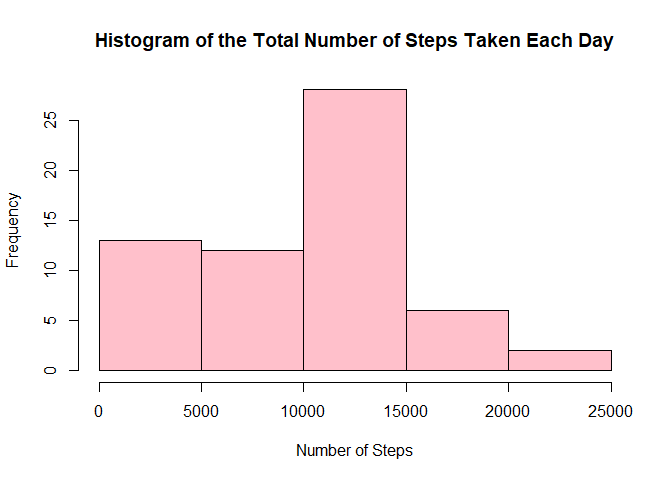
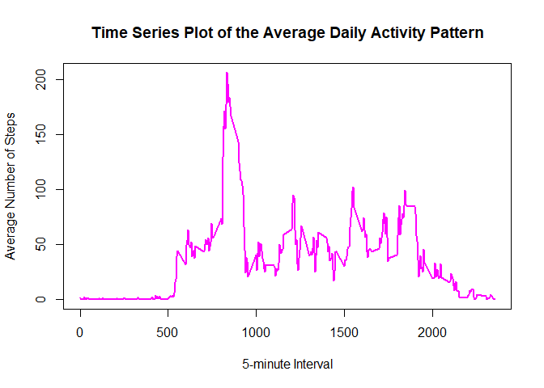
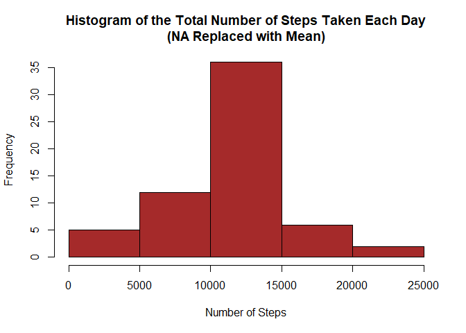
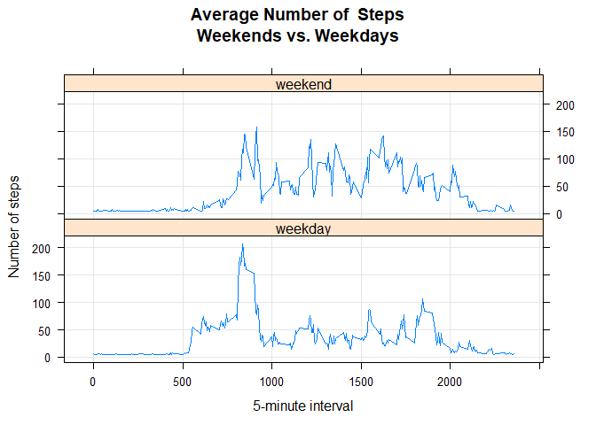

## Loading and preprocessing the data

Unzip the file.

```r
if (!file.exists('activity.csv')) {
  unzip('activity.zip',overwrite=TRUE)
}
```

Load the raw data.

```r
activityRaw <- read.csv("activity.csv", stringsAsFactors=FALSE)
```

Observe the raw data.

```r
head(activityRaw)
```

```
##   steps       date interval
## 1    NA 2012-10-01        0
## 2    NA 2012-10-01        5
## 3    NA 2012-10-01       10
## 4    NA 2012-10-01       15
## 5    NA 2012-10-01       20
## 6    NA 2012-10-01       25
```

Since the data are already in a format suitable for the analysis, there's no need to process/transform them.

## What is mean total number of steps taken per day?

1. Calculate the total steps taken per day.

```r
total.steps <- tapply(activityRaw$steps, activityRaw$date, sum, na.rm=T)
```

2. Make a histogram of the total number of steps taken per day.

```r
hist(total.steps, 
     col="pink", 
     xlab="Number of Steps", 
     main="Histogram of the Total Number of Steps Taken Each Day")
```

<!-- -->

3. Calculate and report the mean and median of the total steps taken per day.

```r
mean.total.steps <- round(mean(total.steps))
mean.total.steps
```

```
## [1] 9354
```

```r
median_total.steps <- round(median(total.steps))
median_total.steps
```

```
## [1] 10395
```

*We can see in the results that the mean of total steps taken per day is 9354 while the median is 10395.*


## What is the average daily activity pattern?

1. Make a time series plot of the 5-minute interval (x-axis) and the average number of steps taken, averaged across all days (y-axis).

Compute the means of steps across all days for each interval.

```r
mean.steps <- aggregate(activityRaw$steps, 
                       by=list(activityRaw$interval), 
                       FUN=mean, 
                       na.rm=TRUE)
```

Rename the attributes.

```r
names(mean.steps) <- c("interval", "mean")
```

Check the data.

```r
head(mean.steps)
```

```
##   interval      mean
## 1        0 1.7169811
## 2        5 0.3396226
## 3       10 0.1320755
## 4       15 0.1509434
## 5       20 0.0754717
## 6       25 2.0943396
```

Create the time series plot.

```r
plot(mean.steps$interval, 
     mean.steps$mean, 
     type="l", 
     col="magenta", 
     lwd=2, 
     xlab="5-minute Interval", 
     ylab="Average Number of Steps", 
     main="Time Series Plot of the Average Daily Activity Pattern")
```

<!-- -->

2. Determine which 5-minute interval, on average across all the days in the data set, contains the maximum number of steps.

Find the position of the maximum mean.

```r
position.max.mean <- which(mean.steps$mean == max(mean.steps$mean))
```

Find the value of interval at this position.

```r
interval.max.mean <- mean.steps[position.max.mean, 1]
interval.max.mean
```

```
## [1] 835
```

*Thus the 5-minute interval that contains the maximum number of steps, on average across all days, is 835.*


## Imputing missing values

1. Calculate and report the total number of missing values in the dataset.


```r
missing.count <- sum(is.na(activityRaw$steps))
```

There are 2304 missing values.

2. Devise a strategy for filling in all of the missing values in the dataset.

Find the positions of NAs.

```r
na.position <- which(is.na(activityRaw$steps))
```

Observe the result.

```r
str(na.position)
```

```
##  int [1:2304] 1 2 3 4 5 6 7 8 9 10 ...
```

Create a vector of means.

```r
vector.means <- rep(mean(activityRaw$steps, na.rm=TRUE), times=length(na.position))
```

Observe the result.

```r
str(vector.means)
```

```
##  num [1:2304] 37.4 37.4 37.4 37.4 37.4 ...
```

The process above is done to be able to replace all NAs with the mean of the steps attribute.

3. Create a new dataset that is equal to the original dataset but with the missing data filled in.

Replace all NAs with the mean of the steps attribute.

```r
activityRaw[na.position, "steps"] <- vector.means
```

Check the new dataset.

```r
head(activityRaw)
```

```
##     steps       date interval
## 1 37.3826 2012-10-01        0
## 2 37.3826 2012-10-01        5
## 3 37.3826 2012-10-01       10
## 4 37.3826 2012-10-01       15
## 5 37.3826 2012-10-01       20
## 6 37.3826 2012-10-01       25
```

4. Make a histogram of the total number of steps taken each day. Calculate and report the mean and median of the total number of steps taken per day. Do these values differ from the estimates from the first part of the assignment? What is the impact of imputing missing data on the estimates of the total daily number of steps?

Calculate the total steps taken per day (without NAs).

```r
total.steps2 <- tapply(activityRaw$steps, activityRaw$date, sum, na.rm=T)
```

Make a histogram of the total number of steps taken per day (without NAs).

```r
hist(total.steps2, 
     col="brown", 
     xlab="Number of Steps", 
     main="Histogram of the Total Number of Steps Taken Each Day\n(NA Replaced with Mean)")
```

<!-- -->

Calculate and report the mean and median of the total number of steps taken per day (without NAs).

```r
mean.total.steps2 <- round(mean(total.steps2))
mean.total.steps2
```

```
## [1] 10766
```

```r
median.total.steps2 <- round(median(total.steps2))
median.total.steps2
```

```
## [1] 10766
```

*We can see in the results that the mean and median of the total number of steps taken per day (without NAs) are both 10766. This value differs from the estimates of the first part of the assignment. The impact made by imputing missing data is producing greater estimates of the total daily number of steps since more data were added.*


## Are there differences in activity patterns between weekdays and weekends?

1. Create a new factor variable in the dataset with two levels – “weekday” and “weekend” indicating whether a given date is a weekday or weekend day.


```r
activityRaw$day <- "weekday"
activityRaw$day[weekdays(as.Date(activityRaw$date), abb=T) %in% c("Sat","Sun")] <- "weekend"
```


```r
table(activityRaw$day)
```

```
## 
## weekday weekend 
##   12960    4608
```


2. Make a panel plot containing a time series plot of the 5-minute interval (x-axis) and the average number of steps taken, averaged across all weekday days or weekend days (y-axis).


```r
mean.steps.int <- aggregate(steps ~ interval + day, data=activityRaw, FUN="mean")
```


```r
library(lattice)
```


```r
xyplot(steps ~ interval | day, data=mean.steps.int, type="l", grid=T, layout=c(1,2),
       ylab="Number of steps", xlab="5-minute interval", main="Average Number of  Steps\nWeekends vs. Weekdays")
```

<!-- -->

